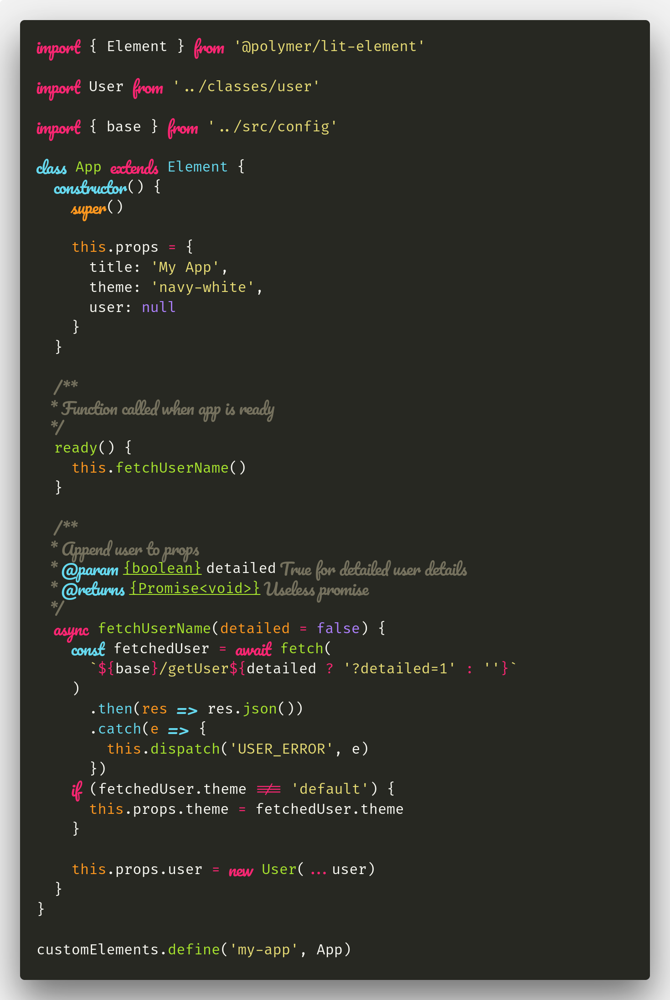

# Firicico
## Combination of Fira Code and Pacifico for Italics.

This is the font set-up I use for programming. It uses Fira Code as default font and Pacifico for the italics. Thanks to Fira Code it also has font ligatures.

### What is it?
As just said, its a combination of two fonts. The Pacifico font-size is additionally slightly increased (115%).

### Setup

Just download/clone the this repo and install the Firicico & Firicico Italic. In the Source fonts-folder you can additionally find the unedited source fonts, if you want to install them too.

Now go to your editor/IDE and change the font to Firicico and enable Font ligatures, if you want them. That's it.

### Customization
The easiest way to customize the fonts (e.g. resize one of them) is with FontForge. Just open the .ttf files, edit them and export them back as ttf. You only have to make sure, that you don't edit any Metadata, as the font wont work otherwise.

### What are italics?

Many editors/IDEs (like VSCode) take the italic font style of the selected font for certain expressions, usually keywords or types. This font replaces the default italic style of Fira Code with another font: Pacifico, so we basically "trick" the program.

> Note: As I only use VSCode, I can't provide details for other editors/IDEs

In VSCode expressions, that are styled in italics are controlled by your theme, but you can change and customize this in the settings under "editor.tokenColorCustomizations".

Here is my example config:

```json
"editor.tokenColorCustomizations": {
    "textMateRules": [
      {
        "scope": [
          //following will be in italics (=Pacifico)
          "comment",
          "entity.name.type.class", //class names
          "keyword", //import, export, return…
          //"support.class.builtin.js", //String, Number, Boolean…, this, super
          "storage.modifier", //static keyword
          "storage.type.class.js", //class keyword
          "storage.type.function.js", // function keyword
          "storage.type.js", // Variable declarations
          "keyword.control.import.js", // Imports
          "keyword.control.from.js", // From-Keyword
          //"entity.name.type.js", // new … Expression
          "keyword.control.flow.js", // await
          "keyword.control.conditional.js", // if
          "keyword.control.loop.js", // for
          "keyword.operator.new.js", // new
        ],
        "settings": {
          "fontStyle": "italic"
        }
      },
      {
        "scope": [
          //following will be excluded from italics (My theme (Monokai dark) has some defaults I don't want to be in italics)
          "invalid",
          "keyword.operator",
          "constant.numeric.css",
          "keyword.other.unit.px.css",
          "constant.numeric.decimal.js",
          "constant.numeric.json",
          "entity.name.type.class.js"
        ],
        "settings": {
          "fontStyle": ""
        }
      }
    ]
  }
```

### Screenshot
Here is a sample using the Monokai theme in VSCode:


